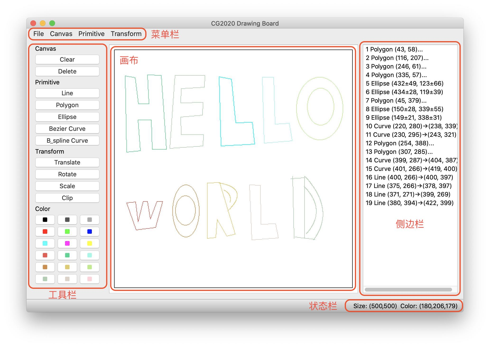

---
geometry:
- top=30mm
- left=20mm
- heightrounded
# mainfont: 'Microsoft YaHei'
# CJKmainfont: 'Microsoft YaHei'
# monofont: 'Consolas'
mainfont: 'STXihei'
fontsize: 12pt
---
<!--
Compile with:
        pandoc manual.md -o ../***REMOVED***_说明书.pdf --pdf-engine=xelatex -f markdown-implicit_figures
 -->

\XeTeXlinebreaklocale "zh"

# 计算机图形学系统设计 - 说明书

***REMOVED*** ***REMOVED*** ***REMOVED***

## 一、使用概要

### 1. 图元类

根据接口指定参数进行操作即可。

### 2. 画板类

根据接口指定参数进行操作即可。

### 3. CLI

`python3 cg_cli.py ${INPUT_FILE} ${OUTPUT_DIR}`

输入文件格式遵守实验要求。

### 4. GUI

`python3 cg_gui.py`

各项依赖遵守实验要求。

{ width=70% }

- 画布

    - 点按图元边界矩形内选择其

    - 重叠时自动选择矩形面积小的

- 侧边栏

    - 点击侧边栏对应的图元也可以完成选择

- 菜单栏

    - File：文件菜单

        - Load TXT (Ctrl+L)：加载命令文件

        - Save BMP (Ctrl+E)：导出图像文件

        - Save TXT (Ctrl+S)：导出命令文件

        - Exit (Ctrl+Q)：退出

    - Canvas：画布菜单

        - Reset (Ctrl+R)：重置画布，不输入参数即为保持现有大小

        - Color (Ctrl+P)：打开调色盘，设定画布颜色

        - Delete (Ctrl+D)：删除指定 id 的图元

    - Primitive：图元添加菜单

        - Line：直线，可选两种算法

        - Polygon：多边形，可选两种算法

        - Ellipse：椭圆

        - Curve：曲线，可选两种算法

    - Transform：图元变换菜单

        - Translate：平移

        - Rotate：旋转

        - Scale：缩放

        - Clip：裁剪线段，可选两种算法

- 工具栏

    - Canvas

        - Clear：清屏

        - Delete：删除所选图元

    - Primitive

        - Line：直线，选择后在画布上点击两个点即可

        - Polygon：多边形，选择后在画布上依次点击控制点，双击结束
            （双击位置不计入控制点）

        - Ellipse：椭圆，点击两边界点

        - Curve：曲线，同多边形，提供两种算法

    - Transform

        - Translate：平移，选择图元后，点击画布将图元中心平移至点击处

        - Rotate：旋转，选择图元后，点击两点，将以边界矩形中点为中心旋转以两控制点为终点的向量之间的夹角

        - Scale：缩放，选择图元后，点击两点，将以边界矩形为中心按两向量长度比值进行缩放

        - Clip：裁剪，选择图元后，若为线段，点按两个控制窗口

    - Color

        - 点按即可选择画笔颜色

        - 若选择了图元，则所选图元也会变成对应颜色

- 状态栏

    - 菜单含义

    - 当前选择的图元的描述

    - 画布大小

    - 画笔颜色

## 二、系统接口

### 1. 基础类

- `Point = Tuple[int, int]`
- `Color = Tuple[int, int, int]`

### 2. 画板类 Board

- `Board(height: int, width: int)`

    初始化画板，要求宽、高为正。设置颜色为黑色。

- `setColor(color: Color)`

    设置画板当前颜色

- `reset(height: int, width: int)`

    初始化画板，与 `Board()` 方法相同。

- `render() -> List[List[Color]]`

    渲染画板所有图元并返回 Bitmap。

- `addPrimitive(id: int, p: Primitive)`

    添加标号为 `id` 的图元，若重复则覆盖。

- `removePrimitive(id: int)`

    删除标号为 `id` 的图元，若没有则忽略。

- `translate(id: int, dx: int, dy: int)`

    平移指定图元。

- `rotate(id: int, x: int, y: int, r: int)`

    旋转指定图元。

- `scale(id: int, x: int, y: int, s: float)`

    缩放指定图元。

- `clip(id: str, x0: int, y0: int, x1: int, y1: int, algorithm)`

    裁剪指定图元，若不为线段类则不进行任何操作。

- `show()`

    在新窗口打开结果图片。

- `save(path: str)`

    储存结果图片。

### 3. 图元基类 Primitive

- `render() -> List[Point]`

    渲染图元，返回像素点列表。

- `translate(dx: int, dy: int)`

    平移图元。

- `rotate(x: int, y: int, r: int)`

    旋转图元。

- `scale(x: int, y: int, s: float)`

    缩放图元。

- `boundingRect() -> QRectF`

    边界矩形。

### 4. 直线类 Line

继承自 `Primitive`

- `Line.Algorithm`
    - `DDA = 1`
    - `Bresenham = 2`

- `Line.ClipAlgorithm`
    - `Cohen_Sutherland = 1`
    - `Liang_Barsky = 2`

- `Line(x0: int, y0: int, x1: int, y1: int, algorithm: Algorithm)`

    创建线段，从 (x0, y0) 指向 (x1, y1)，使用 algorithm 算法。

- `clip(self, x0: int, y0: int, x1: int, y1: int, algorithm: ClipAlgorithm) -> bool`

    裁剪图元，若可接受（至少一像素在框内）则返回 `True`，否则返回 `False`。

### 5. 多边形类 Polygon

继承自 `Primitive`

- `Polygon(points: List[Point], algorithm: Line.Algorithm)`

    创建多边形，顶点为 Point 类型列表，要求不为空。

### 6. 椭圆类 Ellipse

继承自 `Primitive`

- `Ellipse(x0: int, y0: int, x1: int, y1: int)`

    创建椭圆，边界点为 (x0, y0) 与 (x1, y1)。

### 7. 曲线类 Curve

继承自 `Primitive`

- `Curve.Algorithm`

    - `Bezier = 1`
    - `B_spline = 2`

- `Curve(points: List[Point], algorithm: Algorithm)`

    创建曲线，使用 algorithm 算法。控制点坐标为 Point 类型列表，要求不为空。
