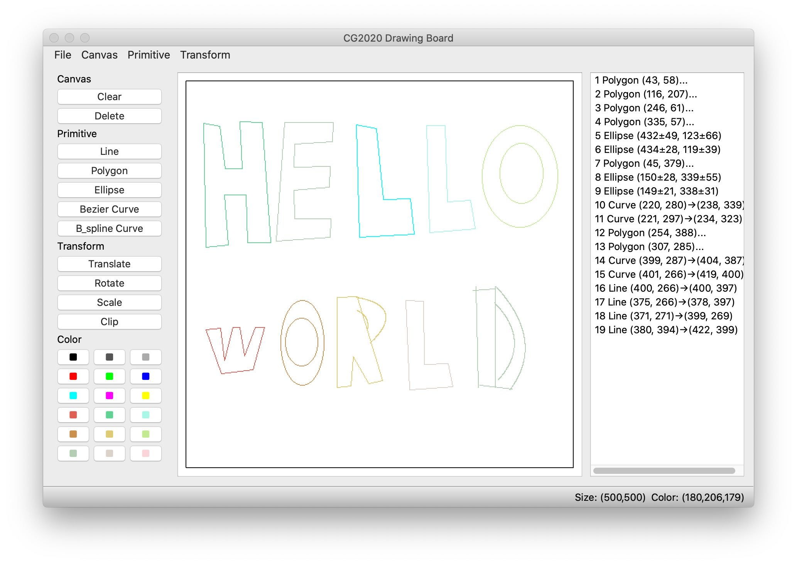

---
geometry:
- top=30mm
- left=20mm
- heightrounded
# mainfont: 'Microsoft YaHei'
# CJKmainfont: 'Microsoft YaHei'
# monofont: 'Consolas'
mainfont: 'STXihei'
fontsize: 12pt
---
<!--
Compile with:
    pandoc report.md -o ../***REMOVED***_报告.pdf --pdf-engine=xelatex -f markdown-implicit_figures
 -->

\XeTeXlinebreaklocale "zh"

# 计算机图形学系统设计 - 实验报告

***REMOVED*** ***REMOVED*** ***REMOVED***

## 一、实现内容

### 1. 基础架构

- 基础类

    - 点类型

    - 颜色类型

- 画板类

    - 重置画板

    - 设置画笔

    - 图元变换

    - 图元添加

    - 图元删除

    - 结果显示

    - 导出图片

- 图元类

    - 图元基类

    - 直线类

    - 多边形类

    - 椭圆类

    - 曲线类

### 2. 绘制算法

- 直线

    - DDA

    - Bresenham

- 多边形

    - DDA

    - Bresenham

- 椭圆

    - 中点椭圆

- 曲线

    - Bezier

    - B-spline

### 3. 变换算法

- 图元平移

- 图元旋转

- 图元缩放

- 线段裁剪

    - Cohen-Sutherland

    - Liang-Barsky

### 4. CLI

命令解析、输出目录维护

### 5. GUI

- CLI 所有功能

    - 交互式

    - 输入式

- 导入、导出命令文件

## 二、运行环境

- Python 3.7.5
- numpy 1.18.1
- Pillow 7.0.0
- PyQt5 5.14.1

## 三、架构详解

> CLI 与 GUI 均未参考或使用课堂给出的框架代码。

> 具体接口参见 manual

### 1. 图元架构

图元类 `Primitive` 是所有图元的抽象基类，提供初始化、渲染、缓存、变换等接口定义。

其他所有图元（直线、曲线等）皆为图元基类的派生类，接口整齐，耦合度低。

### 2. 画板架构

画板类 `Board` 维护画板大小、图元列表、画笔颜色等数据，同时提供重置、渲染、导出、更换画笔、添加图元、删除图元、根据 `id` 修改图元等接口。

可以通过封装好的画板类操作本系统，也可以自行调用图元类手动操作。

### 3. CLI 程序

CLI 程序为画板类 `Board` 的命令行交互接口，循环读取解析指令后对实例化的画板对象进行一系列操作。

### 4. GUI 程序



GUI 程序将各图元类封装成 Qt 接受的组件类型，供交互使用。

1. 图元类

    图元类封装为 `QGraphicsItem`，命名为 `Element`。实现初始化、绘画、边界矩形功能。同时定义了 `ListItem` 类，继承自 `QListWidgetItem`，用于在侧边栏中显示、选择图元。

2. 画布类

    `MainCanvas` 继承自 `QGraphicsView`，管理整个画布与侧边栏。提供图元的增删查改接口、鼠标交互方法。

3. 主窗口

    主窗口初始化了所有布局、画布操作弹窗、保存与载入功能。其中，命令载入功能复用了 CLI 中的 `Board` 类，将命令载入其中后逐图元抽取，添加至 GUI 画布。

## 四、算法详解

### 1. DDA

1. 首先计算横纵距离，总长选取较长的那个；
2. 根据总长计算横纵步长；
3. 从起点离散遍历总长，每次横纵坐标步进对应步长。

### 2. Bresenham

- 以 $dx >= dy$ 为例，遍历 $dx$。维护一个误差值，每次递增，达到 $0.5$ 时将 $y$ 坐标增加 $1$；

- $dy < dx$ 同理。

### 3. 多边形

- 多边形即为由每两相邻坐标点连成的直线构成的图形。

### 4. 中点椭圆

- 椭圆可以分为四个象限，由于对称性，只计算一个象限的点即可，其他三个象限的点可以对称得出；
- 步骤
    1. 一开始，当斜率绝对值 $\vert k\vert >= 1$ 时，以 $y$ 坐标为一步，计算对应的 $x$ 坐标值；
    2. 当 $\vert k\vert < 1$ 时，以 $x$ 坐标为一步，计算对应的 $y$ 坐标值。
- 优化：维护 $2\cdot a^2, b^2$ 等一系列中间值，减少步进时的冗余计算。

### 5. Bezier

- 坐标计算

    $$P_o(u)=\frac{n!}{i!\cdot (n-i)!} P_i(i)\cdot u^i\cdot (i-u)^{n-i}$$

    其中 $u$ 为 $[0,1]$ 内数字，代表输出点所在位置。记步长为 $t$，则 $u\in \{ \frac{i}{t}\vert 1\leq i\leq t \}$

- 步长选择：每两相邻控制点间曼哈顿距离之和乘以三。与所需渲染点数目成正相关。

- 优化：$\frac{n!}{i!\cdot (n-i)!} P_i(i)$ 可以预先计算出来，省去重复计算。

### 6. B-spline

- 实验要求使用三次（四阶），故为：

    $$P(u)=\Sigma_{i=0}{n}P_iB_{i,4}(u),u\in[u_k,u_{n+1}]$$

- 步长与 Bezier 算法中的选取方法相同。


### 7. 平移

- 把所有控制点坐标平移即可。

### 8. 旋转

- 把所有控制点坐标求弧度然后加减对应角度值，然后用距离与其相乘即可。

- GUI 中分别计算两控制向量与水平线夹角，通过判断终点在水平线上、下来分情况计算夹角。

### 9. 缩放

- 横纵坐标与中心点差值乘比例后加中心点坐标。

### 10. Cohen-Sutherland

- 平面划分

    从高到低 4 比特分别代表是否在上下左右侧，全为 0 即为内侧：

    ```
    1001 | 1000 | 1010
    -----+------+-----
    0001 | 0000 | 0010
    -----+------+-----
    0101 | 0100 | 0110
    ```

    这样就可以方便地表示并判断点所在区域了

- 步骤
    1. 检查 $P_1,P_2$ 关系：
        - 若全在内部（全为 0），接受并结束；
        - 若在同侧（与为 0），说明在外面，拒绝并结束；
        - 否则至少有一个在窗口外，继续；
    2. 根据位置判断与哪条边线相交，令交点替代外部点，返回第二步。

### 11. Liang-Barsky

- 假设直线方程如下：
    $$x = x_0 + t(x_1-x_0)=x_0+t\Delta x$$

    $$y = y_0 + t(y_1-y_0)=y_0+t\Delta y$$

- 一点若在窗口内，则有：

    $$tp_i \leq q_i, \forall i\in \{1,2,3,4\}$$

    其中

    $$p_1=-\Delta x,q_1=x_0-x_l$$

    $$p_2=\Delta x,q_2=x_h-x_0$$

    $$p_3=-\Delta y,q_3=y_0-y_l$$

    $$p_4=\Delta y,q_4=y_h-y_0$$

- 计算步骤如下：
    1. 若平行，则有 $p_i = 0$
        - 此时，若 $q_i<0$，则在外部，消去
    2. 若 $p_i<0$，则从外穿入窗口内部；若 $p_i>0$，从内穿出外部
    3. 若 $p_i$ 非零，则 $u=q_i/p_i$ 为与窗口交点
    4. 计算 $u_1=Max(0,q_i/p_i)$，$u_2=Min(1,q_i/p_i)$

        若有 $u_1>u_2$，则在外侧，拒绝这条线。
